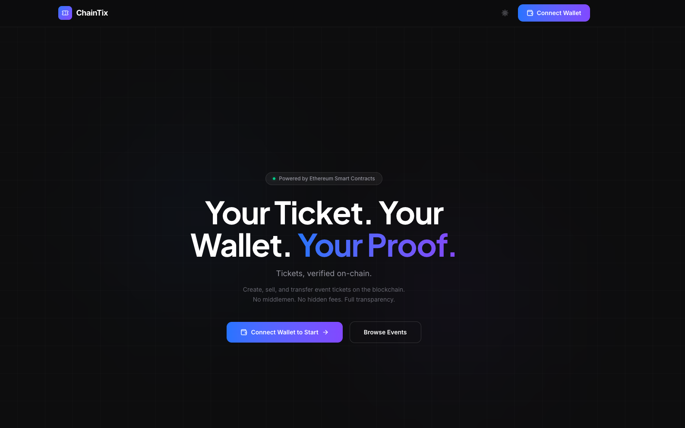
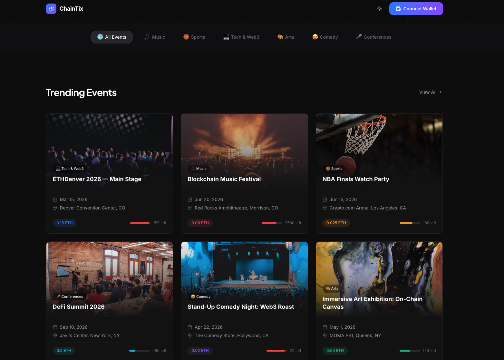

# ChainTix — Decentralized Event Ticketing dApp

> Your Ticket. Your Wallet. Your Proof.

ChainTix is a full-stack decentralized application for creating, purchasing, and managing event tickets on the Ethereum blockchain. No middlemen. No hidden fees. Full transparency.

See [`OVERVIEW.md`](OVERVIEW.md) for a deep dive into the project — problem statement, architecture, and design decisions.

## Screenshots

### Landing Page


### Browse Events


### Create Event


## Features

### For Attendees
- Browse events by category (Music, Sports, Tech, Arts, Comedy, Conferences)
- Purchase tickets with ETH — ticket price + gas, no service fees
- Transfer tickets to any Ethereum address
- Request refunds before the organizer-set deadline
- On-chain proof of ticket ownership

### For Organizers
- Create events with custom pricing, capacity, and refund policies
- Validate tickets at the door with on-chain verification
- Withdraw revenue directly to your wallet after event completion
- Cancel events with automatic refund eligibility for attendees

### Security
- Built against SWC Registry standards (15+ vulnerability classes checked)
- ReentrancyGuard on all ETH-transferring functions
- Checks-Effects-Interactions pattern throughout
- Pull-over-push refund mechanism (no DoS on cancel)
- Pausable emergency stop
- 100% line coverage, 93% branch coverage on smart contract

## Tech Stack

### Smart Contract
- **Solidity 0.8.24** (exact pragma — no floating version)
- **Foundry** (forge, cast, anvil)
- **OpenZeppelin Contracts** (ReentrancyGuard, Pausable, Ownable)

### Frontend
- **React 18** + **TypeScript** + **Vite**
- **ethers.js v6** for blockchain interaction
- **Tailwind CSS v4** with light/dark mode
- **Framer Motion** for animations
- **React Router v6** for client-side routing

## Project Structure

```
event-ticketing-dapp/
├── src/
│   └── EventTicketing.sol          # Main smart contract (602 lines)
├── test/
│   └── EventTicketing.t.sol        # 77 Foundry tests (1261 lines)
├── script/
│   └── Deploy.s.sol                # Deployment script
├── audit/
│   ├── SECURITY_AUDIT.md           # Full smart contract audit report
│   ├── FRONTEND_SECURITY.md        # Frontend security assessment
│   └── DAPP_AUDIT_CHECKLIST.md     # Reusable audit template
├── frontend/
│   ├── src/
│   │   ├── abi/
│   │   │   └── EventTicketing.json # Contract ABI
│   │   ├── components/
│   │   │   ├── events/             # EventCard, EventGrid, EventDetails, CreateEventForm
│   │   │   ├── tickets/            # TicketCard
│   │   │   ├── wallet/             # ConnectButton, WalletContext
│   │   │   ├── layout/             # Header, Footer, Layout
│   │   │   ├── theme/              # ThemeContext (light/dark mode)
│   │   │   └── ui/                 # Skeleton, StatusBadge, TransactionStatus
│   │   ├── hooks/
│   │   │   ├── useWallet.ts        # Wallet connection + chain validation
│   │   │   ├── useContract.ts      # Contract instance management
│   │   │   ├── useEvents.ts        # Event data fetching
│   │   │   └── useTickets.ts       # Ticket data fetching
│   │   ├── lib/
│   │   │   ├── constants.ts        # Chain config, env vars
│   │   │   ├── contract.ts         # Contract helpers, error parsing
│   │   │   ├── formatters.ts       # ETH, date, address formatting
│   │   │   └── seedData.ts         # Demo event data
│   │   ├── pages/
│   │   │   ├── HomePage.tsx         # Landing page (11 sections)
│   │   │   ├── EventsPage.tsx       # Event browsing + filtering
│   │   │   ├── EventPage.tsx        # Event detail + purchase
│   │   │   ├── CreateEventPage.tsx   # Create event form
│   │   │   ├── MyTicketsPage.tsx     # User's ticket collection
│   │   │   ├── OrganizerDashboard.tsx # Organizer management
│   │   │   └── NotFoundPage.tsx
│   │   └── types/
│   │       └── index.ts            # TypeScript type definitions
│   ├── index.html
│   ├── package.json
│   └── vite.config.ts
├── screenshots/
│   ├── home-page.png              # Landing page screenshot
│   ├── trending-events.png        # Event browsing screenshot
│   └── create-event.png           # Create event screenshot
├── .env.example
├── foundry.toml
├── OVERVIEW.md                     # Project deep dive & architecture
├── .github/
│   └── workflows/
│       └── test.yml                # CI: forge test on push
└── README.md
```

## Getting Started

### Prerequisites
- **Node.js 18+**
- **Foundry** (`curl -L https://foundry.paradigm.xyz | bash && foundryup`)
- **MetaMask** browser extension

### Smart Contract

```bash
# Install dependencies
forge install

# Run tests
forge test -vvv

# Run tests with gas report
forge test --gas-report

# Check coverage
forge coverage

# Start local blockchain
anvil --chain-id 31337

# Deploy (in a new terminal)
forge script script/Deploy.s.sol --rpc-url http://localhost:8545 --broadcast
```

### Frontend

```bash
cd frontend

# Install dependencies
npm install

# Create .env file
cp .env.example .env
# Edit .env with your contract address from deployment output

# Start dev server
npm run dev
```

### Environment Variables

**Smart Contract** (`.env`):
```
PRIVATE_KEY=0xac0974bec39a17e36ba4a6b4d238ff944bacb478cbed5efcae784d7bf4f2ff80
RPC_URL=http://localhost:8545
```

**Frontend** (`frontend/.env`):
```
VITE_CONTRACT_ADDRESS=0x...  # From deployment output
VITE_CHAIN_ID=31337
VITE_RPC_URL=http://localhost:8545
```

> **Note**: The private key above is the default Anvil development key. Never use it with real funds.

## Smart Contract API

### Write Functions

| Function | Description | Access |
|----------|-------------|--------|
| `createEvent(...)` | Create a new event | Anyone |
| `purchaseTickets(eventId, qty)` | Buy tickets (payable) | Anyone |
| `transferTicket(ticketId, to)` | Transfer ticket ownership | Ticket Owner |
| `requestRefund(ticketId)` | Refund before deadline | Ticket Owner |
| `validateTicket(ticketId)` | Mark ticket as used at entry | Event Organizer |
| `cancelEvent(eventId)` | Cancel event (enables refunds) | Event Organizer |
| `completeEvent(eventId)` | Mark event complete (enables withdrawal) | Event Organizer |
| `withdrawEventFunds(eventId)` | Withdraw ticket revenue | Event Organizer |
| `pause()` / `unpause()` | Emergency stop | Contract Owner |

### Read Functions

| Function | Returns |
|----------|---------|
| `getEvent(eventId)` | Event struct |
| `getTicket(ticketId)` | Ticket struct |
| `getUserTickets(address)` | uint256[] ticket IDs |
| `getEventTickets(eventId)` | uint256[] ticket IDs |
| `getAvailableTickets(eventId)` | uint256 remaining |
| `isTicketValid(ticketId)` | bool |
| `eventCount()` | uint256 total events |
| `ticketCount()` | uint256 total tickets |
| `getWithdrawnAmount(eventId)` | uint256 withdrawn wei |
| `getRefundedAmount(eventId)` | uint256 refunded wei |
| `getUserEventTicketCount(eventId, user)` | uint256 count |

## Security

See [`audit/SECURITY_AUDIT.md`](audit/SECURITY_AUDIT.md) for the full smart contract audit report.
See [`audit/FRONTEND_SECURITY.md`](audit/FRONTEND_SECURITY.md) for the frontend security assessment.

### Key Security Features

| SWC | Protection | Implementation |
|-----|-----------|----------------|
| SWC-107 | Reentrancy | `ReentrancyGuard` + Checks-Effects-Interactions on all ETH transfers |
| SWC-113 | DoS Prevention | Pull-over-push refund pattern — `cancelEvent` does not loop |
| SWC-105 | Access Control | Organizer-only withdrawals, completion requirement, double-withdrawal tracking |
| SWC-132 | Balance Safety | Internal accounting via mappings, `receive()`/`fallback()` revert |
| SWC-103 | Locked Pragma | Exact `pragma solidity 0.8.24` — no floating version |
| SWC-104 | Call Return | All `.call{value:}` return values checked with `if (!success) revert` |

## Testing

```bash
forge test -vvv
```

**77 tests** across these categories:

| Category | Count | Examples |
|----------|-------|---------|
| Happy Path | 15 | Create, purchase, transfer, refund, validate, withdraw |
| Access Control | 6 | Unauthorized cancel, complete, validate, refund, withdraw |
| Edge Cases — Purchase | 7 | Sold out, canceled, expired, incorrect payment, overpay, zero qty, exceeds max |
| Edge Cases — Refund | 3 | After deadline, already used, already refunded |
| Edge Cases — Transfer | 4 | Zero address, self-transfer, used ticket, refunded ticket |
| Edge Cases — Events | 5 | Before date, already canceled/completed, empty strings, past date |
| Reentrancy | 2 | Malicious contracts attacking refund and withdrawal |
| Financial Accuracy | 3 | Refund amounts, withdrawal amounts, withdrawal after partial refunds |
| Pausable | 4 | Pause blocks operations, unpause resumes, non-owner cannot pause |
| View Functions | 6 | Event/ticket existence, available tickets, user queries |
| Receive/Fallback | 2 | Direct ETH rejected, unknown function calls rejected |

**Coverage**: 100% lines, 98.62% statements, 93.10% branches, 100% functions

## Architecture Decisions

1. **No ERC-721**: Tickets are tracked via mappings, not NFTs. Simpler, cheaper gas. ERC-721 is a future upgrade path for marketplace interoperability.
2. **Pull-over-push refunds**: `cancelEvent` sets status only. Users claim refunds individually via `requestRefund`. Prevents DoS from a single failing refund blocking all others.
3. **Sequential IDs**: Ticket and event IDs are sequential counters (no randomness needed, avoids SWC-120).
4. **Internal balance tracking**: Revenue and refunds tracked via `_withdrawnAmounts` and `_refundedAmounts` mappings. Never uses `address(this).balance` for business logic (SWC-132).
5. **Exact payment**: `purchaseTickets` requires exact ETH — no overpayment accepted. Eliminates excess-refund complexity.
6. **Custom errors**: Gas-efficient custom errors instead of revert strings for all validation failures.

## Roadmap / Future Enhancements

- [ ] ERC-721 token standard for ticket NFTs
- [ ] Commit-reveal purchase scheme for high-demand events (anti front-running)
- [ ] Multi-chain deployment (Polygon, Base, Arbitrum)
- [ ] IPFS integration for event images and metadata
- [ ] Secondary market with royalties to organizers
- [ ] Subgraph for event indexing (The Graph)
- [ ] Mobile wallet support (WalletConnect v2)
- [ ] Fuzz testing with Foundry invariants

## License

MIT
